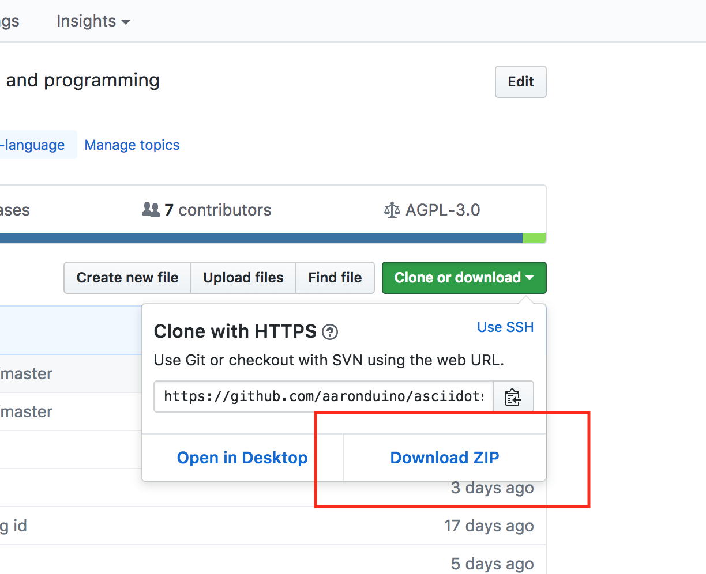

# Getting Started

Welcome to AsciiDots!

## Installation
Requirements:
- Python 3

**Downloading**
With Git:

```
git clone https://github.com/aaronduino/asciidots.git
```

Without git:

Just download the zip from the Github page, and unzip it


## Running
The file to run the interpreter is `__main__.py`.

You can simply run a program with:

```
python3 __main__.py [asciidots file to run]
```

If that doesn't work, try replacing "python3" with "python" in the command above

You can read more about running AsciiDots programs on the [interpreter guide](interpreter.html)

## Quick sample programs to try out

If you just want to run a fun sample program, I suggest running the counter in debug mode:

```
python3 __main__.py samples/counter.dots -y -d -a 0.02
```

If you want something more complex, try this:

```
python3 __main__.py samples/find_primes.dots -d -a 0.02
```

## Programming in AsciiDots
Read the [language guide & docs page](language.html) for a friendly and informative guide to AsciiDots.
